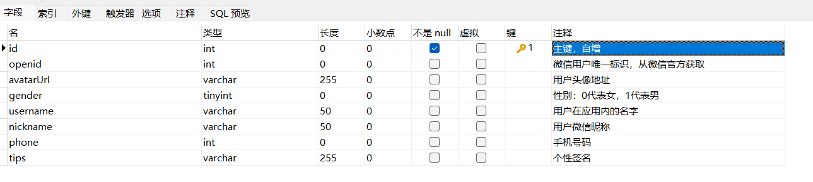
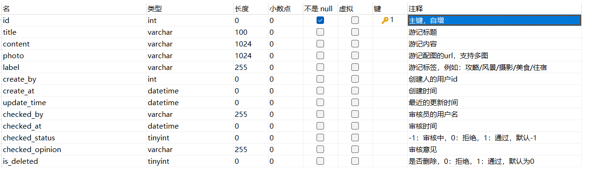
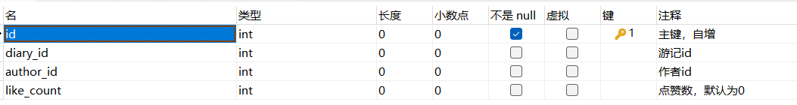
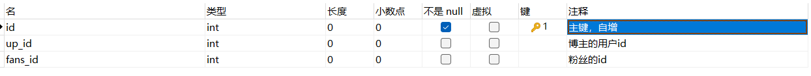
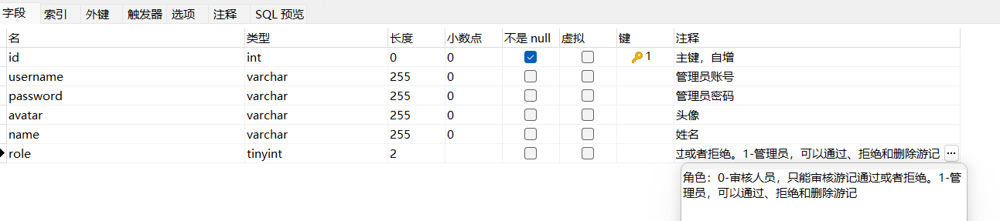
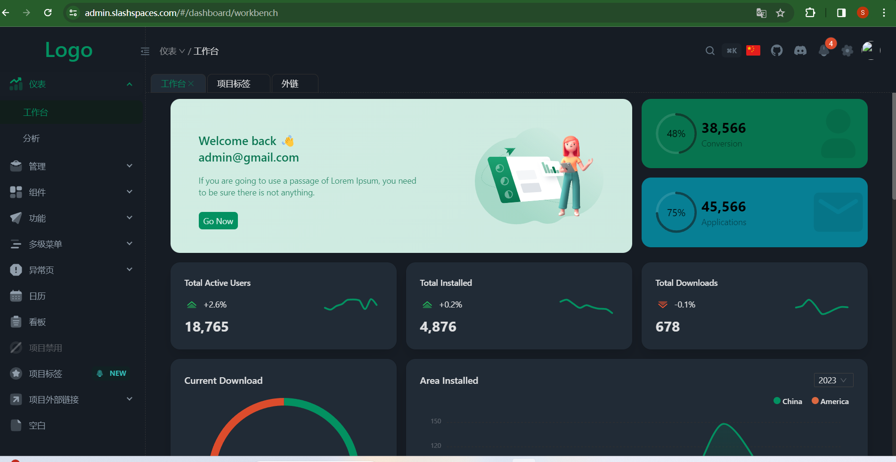
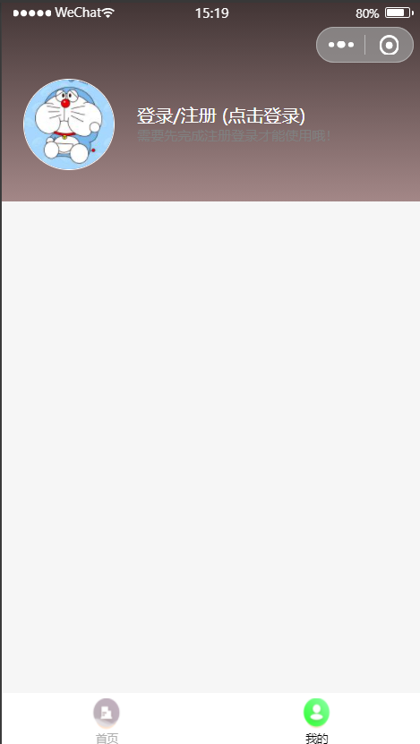
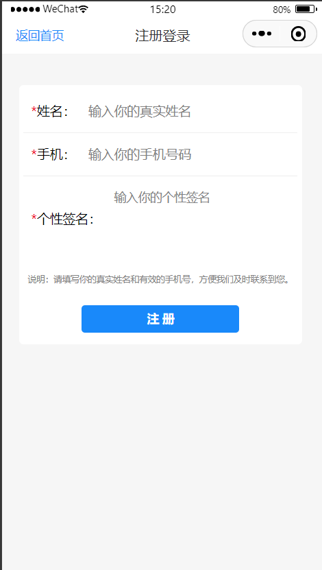
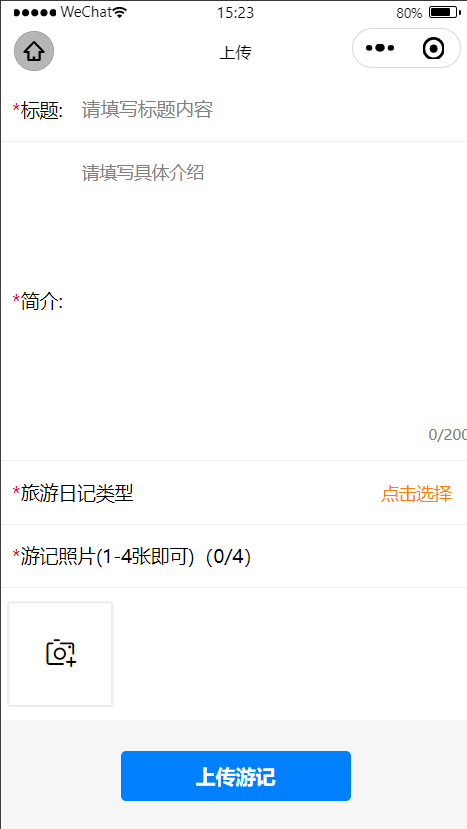
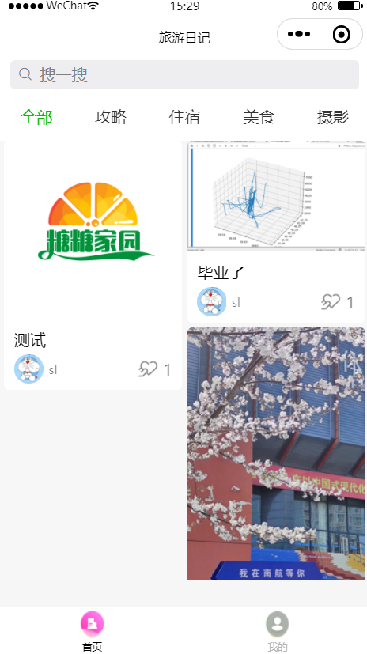

# 主分支-README  (数据库、技术选型、组内分工)
# 一、项目数据库,数据表格5张，sql位于master分支根目录
## 1.user 用户表

## 2.diary 旅游日记表

## 3.like 点赞表

## 4.follow 关注与粉丝表

## 5.admin 管理员表

# 二、技术选型

## 1.客户端

微信原生小程序+lin ui组件库：https://doc.mini.talelin.com/，其他工具库随意使用。

## 2.服务器端

nodejs+express+mysql+jwt

## 3.管理系统

slash  admin（基于react+antdesign设计的通用后台管理系统）https://admin.slashspaces.com/

## 4.静态资源

图片等资源上传至oss阿里云对象存储。（密钥等信息发在qq群文件）

# 三、小程序部分原型图

# 四、分工

## 刘焱琪：

- 客户端微信登录注册实现
- 游记发布
- 审核列表

## 李天琪：

- 我的游记
- 游记详情
- 管理系统的用户数据分析

## 邱善龙：

- 游记列表（首 页）
- 游记的点赞、关注
- 管理系统后端接口开发

# 五、拓展功能（如果时间来不及就算了）

- 游记评论
- 个性化推荐
- 视频上传