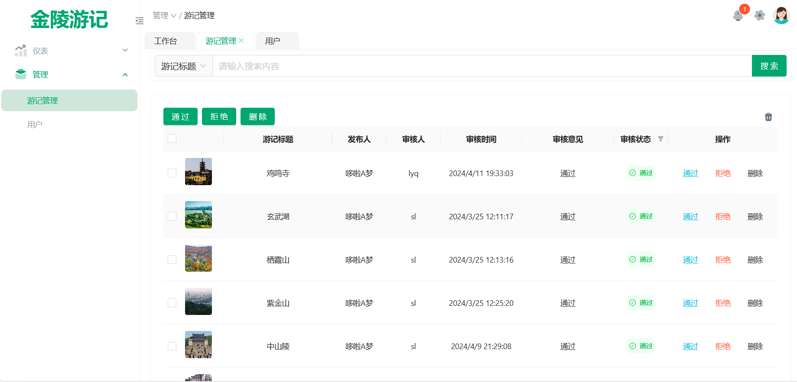

<div align="center"> 
<br> 
<br>
<h1>金陵游记管理系统
</h1>
</div>

## 简介

金陵游记管理系统其核心功能在于严格审核用户发布的游记内容，以确保游记的真实性、合规性和质量，从而为用户提供一个优质、可信的游记分享与交流环境。并且提供数据分析服务为平台的优化和拓展提供决策支持。

## 技术

- 使用 React 18 + TypeScript 进行构建编写。
- 基于 Vite 进行快速开发和热模块替换。
- 使用 Ant Design 与 Tailwind CSS 的 UI 组件。
- 使用 Zustand 进行状态管理。

## 功能概述

1. <h4>不同角色用户登录注册退出</h4>

- 审核人员：只能对游记进行审核、搜索操作
- 管理员：可对游记进行审核、删除、恢复游记、搜索操作

2. <h4>游记管理</h4>

- 游记搜索：根据用户名或游记名称搜索
- 游记筛选：根据审核状态筛选游记
- 游记审核：查看游记详情并对游记进行通过、拒绝操作，拒绝需填写拒绝原因，通过默认审核意见为通过
- 游记删除：只有管理员才能对游记进行删除和撤销操作
- 游记批量管理：提供游记批量审核通过、拒绝、删除操作

<h3>扩展功能</h3>

3. <h4>数据分析</h4>

- 数据可视化查看游记数量、用户数量、用户喜爱类别等关键指标

4. <h4>用户管理</h4>

- 用户搜索：根据用户名搜索
- 用户删除：只有管理员才能删除用户

5. <h4>切换主题样式</h4>

- 可切换黑夜白天模式、全屏模型、面包屑导航栏、布局、主题颜色等

6. <h4>通知消息</h4>

- 提示用户有多少条待审核游记需处理

## 快速开始

### 安装依赖

进入`travel_diary_management`目录下运行以下命令安装项目依赖：

```bash
pnpm install
```

### 启动开发服务器

运行以下命令以启动开发服务器：

```bash
pnpm dev
```

访问 [http://localhost:3001](http://localhost:3001) 查看您的应用程序。

## 部分界面展示

 
